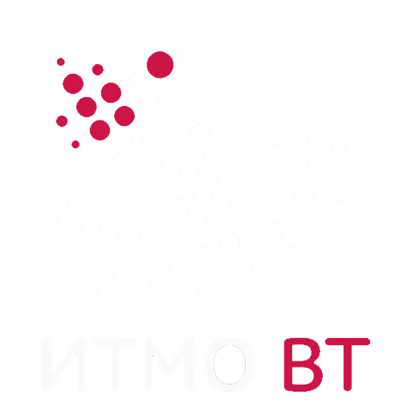

# VT_labs_1

## Programming:
[Lab2](https://github.com/Kyoto67/VT_labs_1/tree/Programming_lab2)
[Lab3](https://github.com/Kyoto67/VT_labs_1/tree/Programming_lab3)
[Lab4](https://github.com/Kyoto67/VT_labs_1/tree/Programming_lab4)
[Lab5](https://github.com/Kyoto67/VT_labs_1/tree/Programming_lab5)
[Lab6](https://github.com/Kyoto67/VT_labs_1/tree/Programming_lab6)

## Faculty of Professional Activity:
[Lab1](https://github.com/Kyoto67/VT_labs_1/tree/Faculty_of_Professional_activity_lab1)
[Lab2](https://github.com/Kyoto67/VT_labs_1/tree/Faculty_of_Professional_activity_lab2)
[Lab3](https://github.com/Kyoto67/VT_labs_1/tree/Faculty_of_Professional_activity_lab3)
[Lab4](https://github.com/Kyoto67/VT_labs_1/tree/Faculty_of_Professional_activity_lab4)
[Lab5](https://github.com/Kyoto67/VT_labs_1/tree/Faculty_of_Professional_activity_lab5)
[Lab6](https://github.com/Kyoto67/VT_labs_1/tree/Faculty_of_Professional_activity_lab6)

## Computer Science
[Lab2](https://github.com/Kyoto67/VT_labs_1/tree/Computer_Science_lab2)
[Lab3](https://github.com/Kyoto67/VT_labs_1/tree/Computer_Science_lab3)
[Lab4](https://github.com/Kyoto67/VT_labs_1/tree/Computer_Science_lab4)
[Lab5](https://github.com/Kyoto67/VT_labs_1/tree/Computer_Science_lab5)
[Lab6](https://github.com/Kyoto67/VT_labs_1/tree/Computer_Science_lab6)
